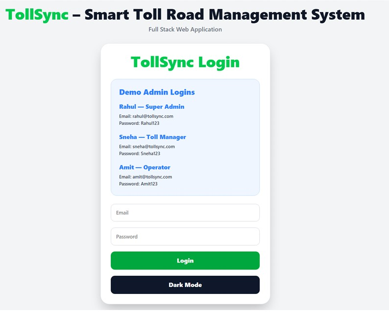

# TollSync – Smart Toll Road Management System

A modern full-stack web application developed to digitally manage toll road operations through an interactive dashboard, secure authentication system, vehicle management, transaction monitoring, and analytics visualization.

# 🔐 Login Page


---

# 🚀 Features

## 🔐 Authentication & RBAC

* Secure Login System
* Role-Based Access Control (RBAC)
* Multiple Admin Roles:

  * Super Admin
  * Toll Manager
  * Operator

---

## 📊 Dashboard Analytics

* Revenue Overview
* FASTag Analytics
* Vehicle Statistics
* Toll Plaza Monitoring
* Interactive Graphs & Charts

---

## 🚗 Vehicle Management

* Add Vehicles
* Delete Vehicles
* View Vehicle Details
* FASTag Balance Monitoring
* Dynamic Dashboard Updates

---

## 💳 Transaction Monitoring

* Transaction Tracking
* Recharge Information
* Payment Status
* Transaction Summaries

---

## 🛣 Toll Plaza Monitoring

* Plaza Status
* Traffic Analysis
* Vehicle Count Monitoring
* Operational Tracking

---

## 👥 User Management

* View Users
* Track Active/Inactive Status
* Role Monitoring
* Access Management

---

## 📈 Reports & Analytics

* Revenue Reports
* Vehicle Statistics
* Transaction Analytics
* Operational Reports

---

## ⚙ Settings Module

* Dark Mode Support
* Security Settings
* Notification Management
* Application Customization

---

# 🛠 Technologies Used

## Frontend

* React.js
* JavaScript
* HTML5
* CSS3
* Tailwind CSS
* Vite

## Backend

* Node.js
* Express.js

## Database

* MongoDB Atlas

## APIs

* RESTful APIs

---

# 🧠 Project Objectives

* Build a smart toll management platform
* Implement secure authentication
* Manage vehicles dynamically
* Monitor toll operations
* Generate analytics and reports
* Demonstrate modern full-stack architecture
* Implement Role-Based Access Control (RBAC)

---

# 🏗 System Architecture

Frontend (React + Tailwind CSS)
⬇
REST API Communication
⬇
Backend Server (Node.js + Express.js)
⬇
MongoDB Atlas Database

---

# 🔄 System Workflow

1. Administrator logs into the system
2. Authentication is verified
3. Dashboard analytics are loaded
4. User navigates between modules
5. Vehicles are managed dynamically
6. Transactions are monitored
7. Reports are generated
8. Analytics update in real-time

---

# 🌙 Dark Mode Support

The application includes a responsive dark mode interface for better user experience and accessibility.

---

# 📦 Installation & Setup

## Clone Repository

```bash
git clone https://github.com/yourusername/tollsync.git
```

## Navigate to Project

```bash
cd tollsync
```

## Install Dependencies

```bash
npm install
```

## Run Frontend

```bash
npm run dev
```

## Run Backend

```bash
node server.js
```

---

# 🌐 Live Demo

Demo Video Link: https://drive.google.com/file/d/1XfnPbIgrbeFZh_sBK6CNHvA-Dj7Eersm/view?usp=sharing

---

# 📌 Future Enhancements

* FASTag API Integration
* AI-Based Traffic Prediction
* IoT Real-Time Monitoring
* Payment Gateway Integration
* Mobile Application Support
* QR Code Verification
* Cloud Deployment

---

# 📚 References

* React.js Official Documentation
* Tailwind CSS Documentation
* MDN Web Docs
* Node.js Documentation
* MongoDB Atlas Documentation
* REST API Concepts

---

# 📄 License

This project is developed for educational and academic purposes.
